# Secure Networking Tracker

A private networking tracker for the people you want to stay connected with at Berkeley. Each user signs in with their own account and manages a personal contact list: name, company, role, where you met, notes, and a priority level. Contacts are stored in Neon Postgres and isolated per user by Row Level Security enforced **in the database**, so one user can never read or modify another user's records even though the Data API is publicly reachable. Built with Next.js, deployed on Vercel.

**Live app:** https://networking-tracker-five-sage.vercel.app

---

## Contents
- [Product Walkthrough](#product-walkthrough)
- [Features](#features)
- [Technology Stack](#technology-stack)
- [Architecture](#architecture)
- [Local Setup](#local-setup)
- [Environment Variables](#environment-variables)
- [Database Schema](#database-schema)
- [Authentication and RLS Ownership](#authentication-and-rls-ownership)
- [Testing](#testing)
- [Deployment](#deployment)
- [Security Verification](#security-verification)
- [Known Limitations and Next Steps](#known-limitations-and-next-steps)

---

## Product Walkthrough

All 15 screenshots below were captured from the deployed application at
`https://networking-tracker-five-sage.vercel.app`, not from localhost.

**Sign in and sign out**

Signed-out visitors land on the sign-in page; `/contacts` redirects here.

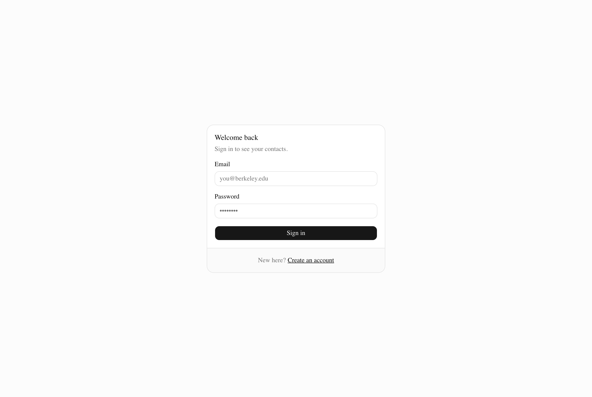
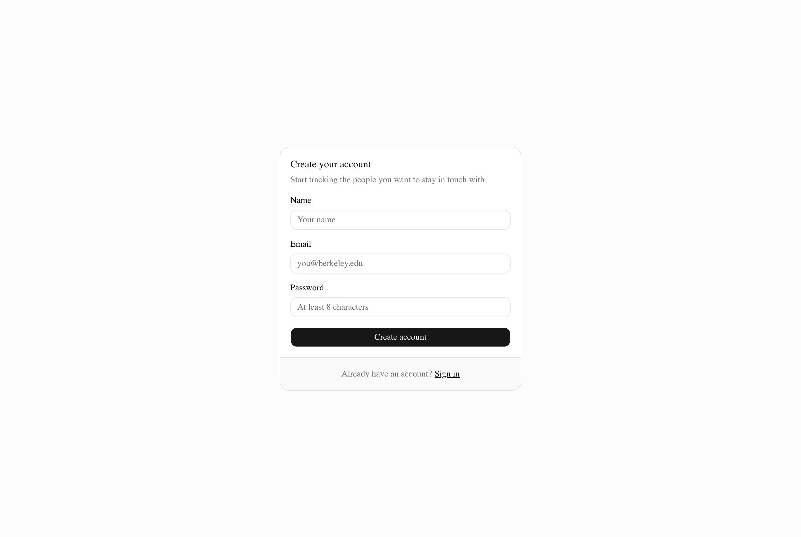

After clicking **Sign out**, the session ends and the app returns to sign-in.


**Creating a contact**

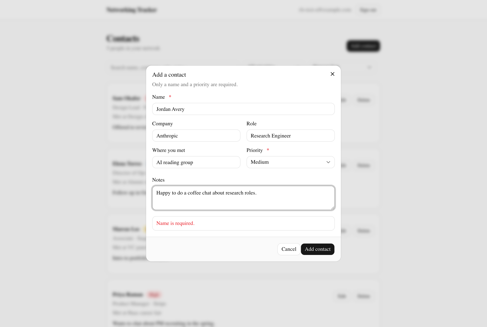

**The contact list — success state**

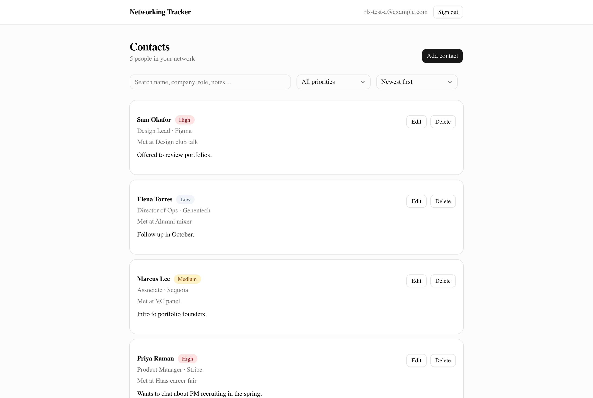

**Editing and deleting a contact**

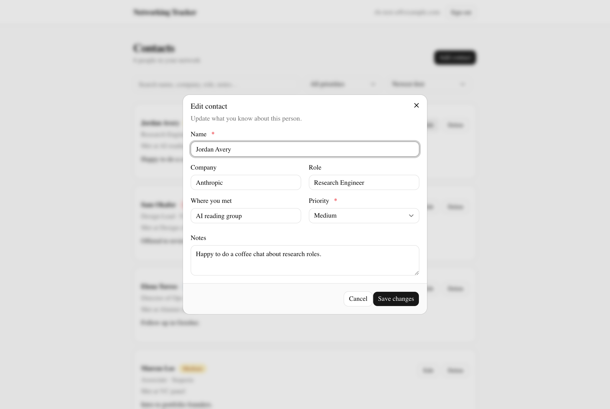
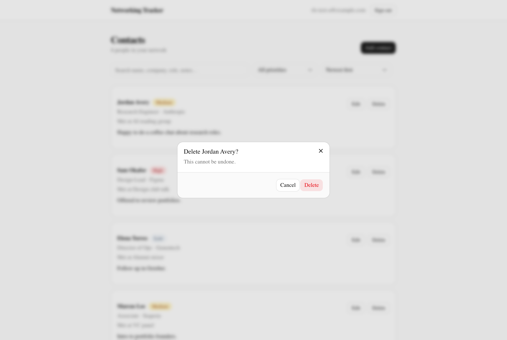

**Data surviving a browser refresh**

The same list after a full page reload — the rows come back from Neon Postgres,
not from browser state.

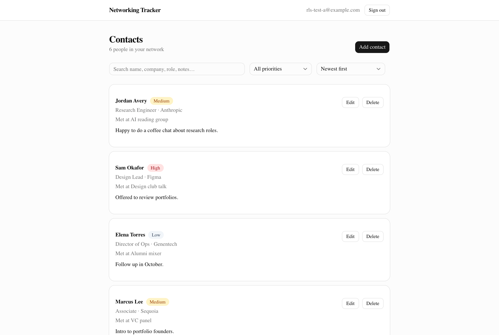

**Sorting and filtering the contact list**

Filtered to `High` priority and sorted `Name A–Z`. The header reports
"Showing 2 of 6" so the active filter is visible rather than silent.

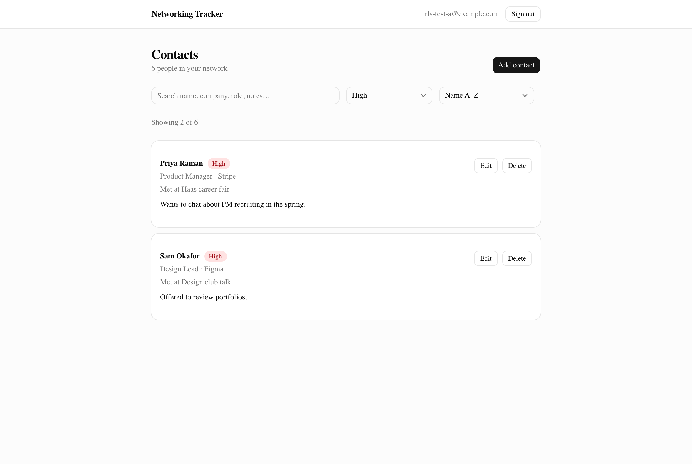

**Invalid input failing safely**

Submitting with an empty name. The field is marked invalid and the reason is
stated in plain language. The same submission is rejected again server-side by
`validateContact()` and a third time by the `contacts_name_not_blank` CHECK
constraint, so the message is a courtesy, not the defence.

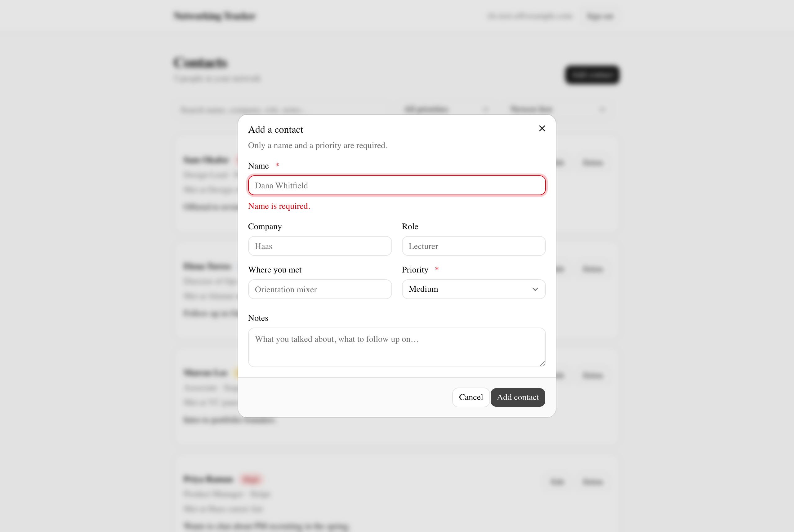

**Mobile view**

At 390×844. Controls stack, the header collapses, and cards reflow.

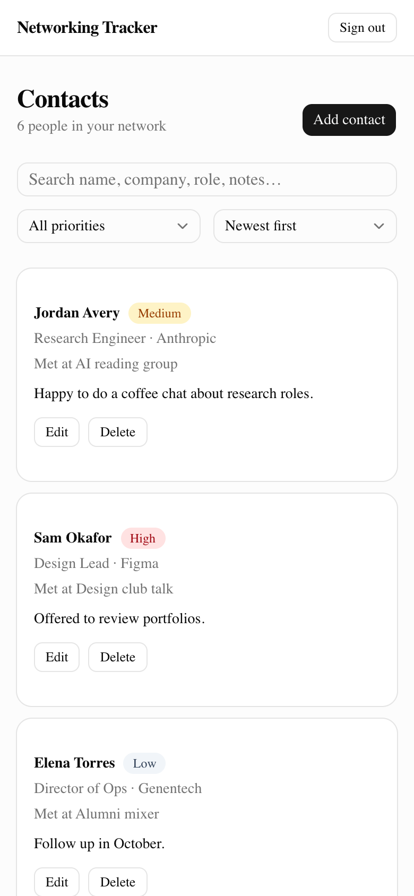

**The four list states**

*Loading* — skeleton rows matching the shape of the real content, so the
layout does not jump when data arrives. Captured with the Data API response
held open:

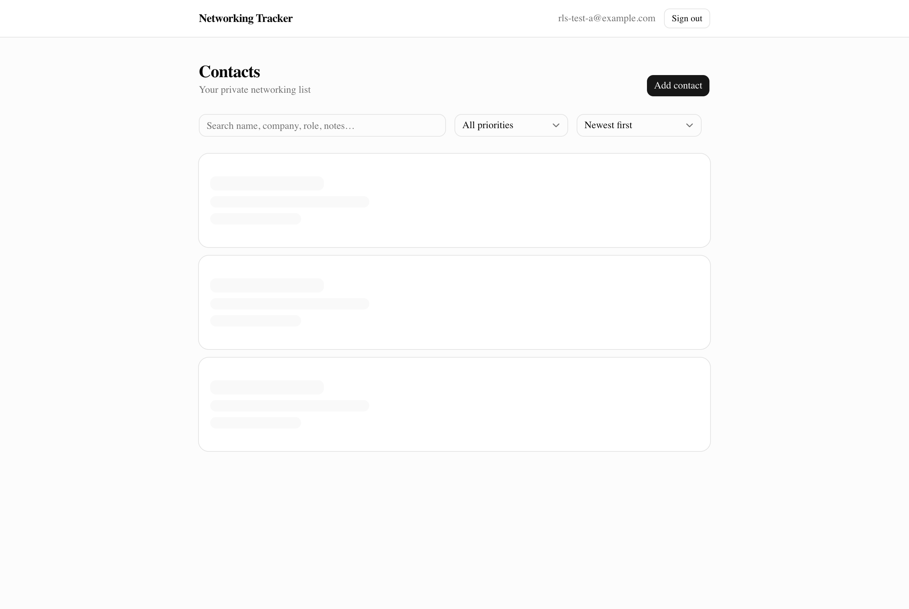

*Empty* — distinct from "your filters match nothing", which has its own copy
and a Clear filters action:

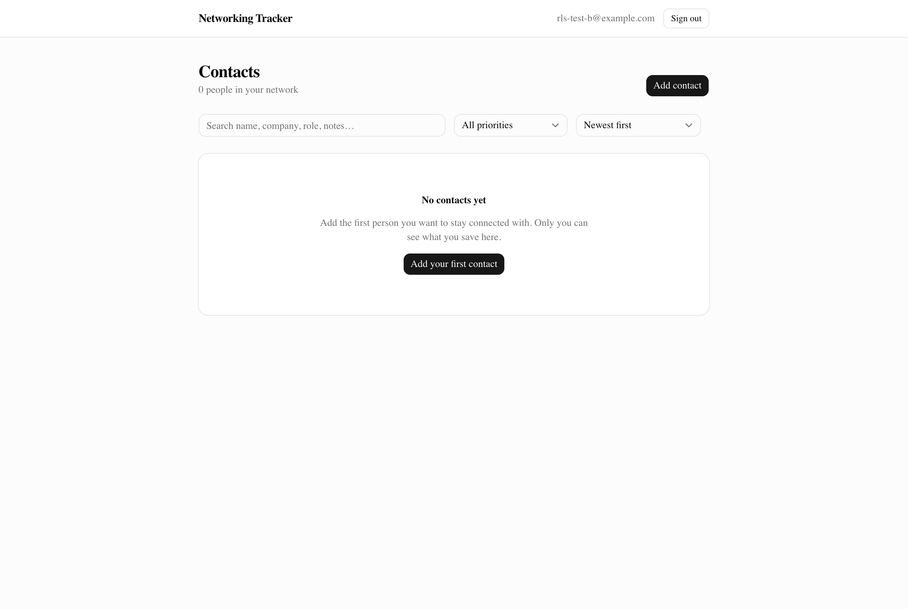

*Error* — captured by forcing the contacts request to fail. The message is
written for a person and the retry is one click, with no raw exception text:

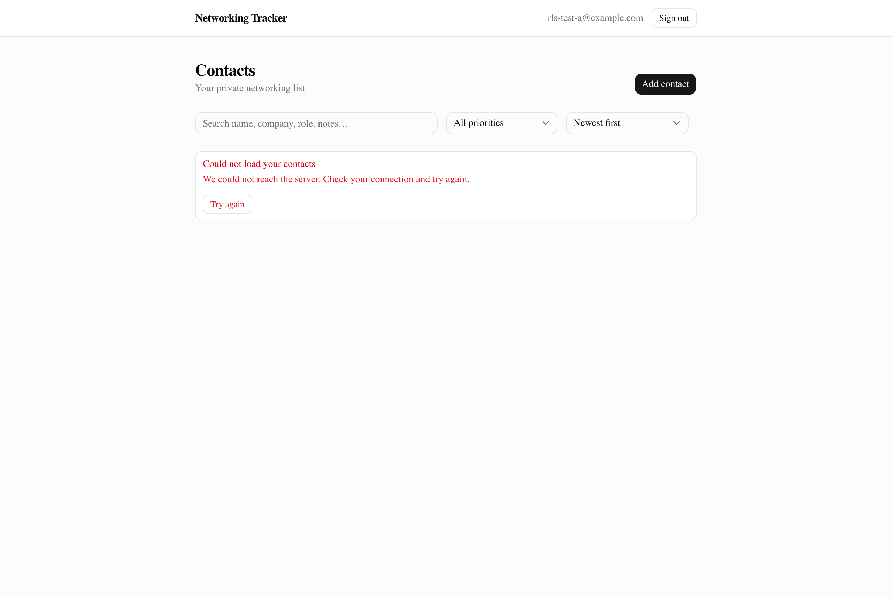

*Success* is the populated list shown further up.

---

## Features

- Sign up, sign in, and sign out
- Add a contact with name, company, role, where you met, notes, and priority
- Priority is restricted to `high`, `medium`, or `low`
- View contacts in a sortable, filterable list
- Sort by newest, oldest, name A–Z, name Z–A, or priority
- Filter by priority and search across name, company, role, where you met, and notes
- Edit and delete your own contacts
- Contacts persist across browser refreshes
- Empty names and invalid priority values are rejected with a clear error message
- Distinct loading, empty, success, and error states — including a separate empty state for "you have no contacts" versus "your filters match nothing"
- Responsive layout that works on desktop and mobile
- Every contact row is private to the user who created it, enforced at the database layer

---

## Technology Stack

| Layer | Choice | Why |
|---|---|---|
| Frontend | Next.js 16 (App Router) + React 19 | Server and client components in one framework, first-class Vercel support, and route handlers give a real backend without standing up a second service |
| Styling | Tailwind CSS v4 + shadcn/ui | Satisfies the design-system requirement and gives accessible, responsive components (dialog, select, alert) without hand-rolling CSS or ARIA |
| Backend | Next.js route handlers under `/app/api` | Keeps validation and secret-bearing logic on the server, separate from the client bundle |
| Authentication | Neon Managed Better Auth | Handles sign-up, sign-in, sessions, and sign-out, and exposes `auth.user_id()` inside Postgres so RLS policies can reference the signed-in user |
| Database | Neon Postgres | Managed Postgres with serverless scaling, native RLS, and direct integration with Neon Auth |
| Data access | Neon Data API via `@neondatabase/neon-js` | Queries Postgres over HTTPS with the user's auth token attached, so RLS applies to every request |
| Testing | Vitest | Fast, zero-config for TypeScript, and runs the validation module directly with no server or database needed |
| Hosting | Vercel | Free tier, Git-triggered deploys, native Next.js support and environment variable management |
| Source control | Git + GitHub | Version history and the single submission surface |

---

## Architecture

**Request flow:**

```
Browser (Next.js client)
   |
   |-- 1. Sign in --> Neon Managed Better Auth --> session JWT
   |
   |-- 2. READS: client.from('contacts').select()
   |         --> Neon Data API (HTTPS, JWT attached automatically)
   |                                |
   |                                v
   |                          Neon Postgres
   |                          SELECT policy evaluates auth.user_id() = user_id
   |
   |-- 3. WRITES: POST/PATCH/DELETE /api/contacts  (Authorization: Bearer <JWT>)
             |
             v
       Next.js route handler
       - validates with lib/validation.ts   <-- trusted, cannot be skipped
       - forwards to the Data API AS THE CALLER, using their JWT
             |
             v
       Neon Postgres
       INSERT / UPDATE / DELETE policies + CHECK constraints
```

**Frontend.** A Next.js App Router application. Client components render the contact list, the add/edit dialog, and the sort and filter controls, and hold UI state for loading, empty, success, and error conditions. The frontend holds only the two public `NEXT_PUBLIC_*` URLs. It never holds a Postgres connection string.

The browser's Neon client is built with the **two-URL object form**, one object naming two independent endpoints:

```ts
// lib/auth/client.ts
export const neon = createClient<Database>({
  auth:    { url: process.env.NEXT_PUBLIC_NEON_AUTH_URL! },
  dataApi: { url: process.env.NEXT_PUBLIC_NEON_DATA_API_URL! },
});
```

The client attaches the session JWT to every Data API request automatically, which is what lets `auth.user_id()` resolve inside Postgres.

**Backend.** Server-side logic lives in route handlers under `app/api/contacts/`. `POST /api/contacts` creates, `PATCH /api/contacts/:id` edits, and `DELETE /api/contacts/:id` removes. Each one runs `validateContact()` from `lib/validation.ts` before touching the database, and that validation is additionally backed by CHECK constraints in Postgres, so a request that bypasses the UI *and* the API still cannot write bad data.

Two decisions in this layer are worth calling out:

1. **Writes take a server detour; reads do not.** Validation that runs only in the browser is advisory — anyone can skip the UI with `curl`. Routing writes through the server makes validation unskippable for the app's own write path. Reads need no such treatment, because reads cannot corrupt data and RLS already scopes them.

2. **The server borrows the user's identity rather than having its own.** `lib/server/data-api.ts` builds a Data API client from the caller's JWT via `getToken`, and never uses `DATABASE_URL`. `DATABASE_URL` bypasses RLS entirely; if the app used it for queries, every policy in `db/schema.sql` would become decorative and correctness would depend on remembering a `where user_id = ...` clause in every query. Because the server has no privileges of its own, a bug in a route handler cannot leak another user's rows.

The route handlers also never decode or verify the JWT themselves. There is no need: Neon validates the signature, and Postgres derives `auth.user_id()` from it. A forged or expired token produces an error from the database, not a trusted identity in application code.

**Database.** Neon Postgres holds a single `contacts` table. Ownership is a column on the row (`user_id`), not a filter in application code. RLS policies on the table are what actually enforce isolation.

**Authentication.** Neon Managed Better Auth issues and validates sessions. Its critical role in this architecture is that it makes the signed-in user's identity available inside Postgres as `auth.user_id()`, which is the value every RLS policy compares against.

**Hosting.** Vercel builds from the GitHub repository on push and serves the app at a public URL. Production environment variables are configured in the Vercel dashboard, and the deployed domain is registered in Neon Auth's trusted origins so sign-in works in production.

**The key design decision:** because RLS is enforced in Postgres, the security model does not depend on the frontend behaving correctly. Even if someone called the public Data API directly with their own token and no UI at all, they would still only ever get their own rows back.

---

## Local Setup

**Prerequisites:** Node.js 18+, npm, Git, and a free Neon account.

```bash
# 1. Clone and install
git clone <YOUR-REPO-URL>
cd networking-tracker
npm install

# 2. Set up environment variables
cp .env.example .env.local
# Open .env.local and fill in the values from your own Neon project dashboard.
# .env.local is gitignored and must never be committed.

# 3. Apply the database schema
npm run db:push
# Reads DATABASE_URL from .env.local, applies db/schema.sql, then prints the
# resulting table definition, CHECK constraints, and active RLS policies.
# You can also paste db/schema.sql into the Neon SQL console instead.

# 4. Run
npm run dev
# Open http://localhost:3000
```

**Available scripts**

| Command | What it does |
|---|---|
| `npm run dev` | Start the dev server |
| `npm run build` | Production build |
| `npm test` | Run the validation test suite once |
| `npm run test:watch` | Run tests in watch mode |
| `npm run db:push` | Apply `db/schema.sql` and report the resulting schema and policies |

---

## Environment Variables

Real values live in `.env.local` (gitignored) and in the Vercel dashboard for production. `.env.example` is committed with placeholder values only.

| Variable | Scope | Purpose |
|---|---|---|
| `NEXT_PUBLIC_NEON_AUTH_URL` | Public | HTTPS Neon Auth endpoint. Safe to expose; RLS protects the data behind it. |
| `NEXT_PUBLIC_NEON_DATA_API_URL` | Public | HTTPS Neon Data API endpoint. Safe to expose for the same reason. |
| `DATABASE_URL` | **Server only** | Direct Postgres connection string. Bypasses RLS, so it must never reach the browser or Git. Used only by `npm run db:push`. |
| `NEON_DATA_API_URL` | **Server only** | Same endpoint as the public Data API URL, read by the write route handlers so server code never reaches for a public variable. |

The Neon endpoints follow these shapes:

```
NEXT_PUBLIC_NEON_AUTH_URL      https://<endpoint>.neonauth.<region>.aws.neon.tech/<db>/auth
NEXT_PUBLIC_NEON_DATA_API_URL  https://<endpoint>.apirest.<region>.aws.neon.tech/<db>/rest/v1
```

`NEON_AUTH_BASE_URL` and `NEON_AUTH_COOKIE_SECRET` are **not used** by this implementation. The assignment requires them to be server-only "if your implementation uses them." Because the starter prompt mandates the `@neondatabase/neon-js` two-URL object form for authentication, the browser talks to Neon Auth directly and Neon manages the session, so there is no Next.js cookie-signing proxy to configure. Fewer secrets is a smaller attack surface; there is no cookie secret to leak because there is no cookie secret.

Any variable prefixed `NEXT_PUBLIC_` is compiled into the client bundle and is readable by anyone. Server-only variables are deliberately not prefixed. `lib/server/data-api.ts` additionally imports `server-only`, which makes the build fail if that module is ever pulled into a client component.

---

## Database Schema

**Table: `contacts`**

| Column | Type | Constraints | Notes |
|---|---|---|---|
| `id` | `uuid` | primary key, default `gen_random_uuid()` | Row identifier. Random, not sequential, so an id leaks nothing about how many rows exist. |
| `user_id` | `text` | not null, default `auth.user_id()` | Owner. Set by the database from the auth context, not by the client. |
| `name` | `text` | not null, `check (length(btrim(name)) > 0)` | Contact's name. Empty and whitespace-only values rejected. |
| `company` | `text` | nullable | |
| `role` | `text` | nullable | Their job title |
| `met_at` | `text` | nullable | Where you met them |
| `notes` | `text` | nullable | Free-text notes |
| `priority` | `text` | not null, default `'medium'`, `check (priority in ('high','medium','low'))` | Enforced by the database, not just the UI |
| `created_at` | `timestamptz` | not null, default `now()` | |

There is also an index on `(user_id, created_at desc)`, matching the only query pattern the app has — "my rows, newest first" — so RLS filtering stays cheap as the table grows.

Note on `name`: `not null` alone still permits the empty string `''`, so the CHECK constraint is what actually enforces the requirement that empty names fail.

Full DDL including RLS policies is in [`db/schema.sql`](db/schema.sql).

---

## Authentication and RLS Ownership

**Authentication.** Neon Managed Better Auth handles sign-up, sign-in, session persistence, and sign-out. Once a user is signed in, their identity is available inside Postgres via the `auth.user_id()` function.

**Ownership rule.** Every row in `contacts` carries a `user_id`. It defaults to `auth.user_id()`, so the database stamps the owner itself rather than trusting a value sent by the client. The application never sends a `user_id` on insert — and `validateContact()` allow-lists fields, so a hand-crafted request that includes one has it dropped before it reaches the database.

**Row Level Security.** `alter table public.contacts enable row level security` flips the table from "allow unless forbidden" to "forbid unless allowed": after that statement, no row is visible or writable to anyone until a policy explicitly permits it. Four separate policies then apply to authenticated users:

| Operation | Clause | Rule |
|---|---|---|
| `select` | `USING` | `auth.user_id() = user_id` |
| `insert` | `WITH CHECK` | `auth.user_id() = user_id` |
| `update` | `USING` **and** `WITH CHECK` | `auth.user_id() = user_id` |
| `delete` | `USING` | `auth.user_id() = user_id` |

**`USING` vs `WITH CHECK`.** `USING` determines which *existing* rows an operation is allowed to touch. `WITH CHECK` validates the *resulting* row before it is allowed to commit. That is why each verb takes a different combination:

- **SELECT** only reads existing rows, so it takes `USING` only. Rows that fail it are not an error — they simply do not exist as far as the query is concerned, so another user's contacts return zero rows rather than "permission denied."
- **INSERT** has no existing row to test, so it takes `WITH CHECK` only. This blocks writing a row stamped with somebody else's `user_id`.
- **DELETE** has no resulting row to validate, so it takes `USING` only.
- **UPDATE needs both**, and the two clauses stop two different attacks. `USING` stops you from editing someone else's row. `WITH CHECK` stops you from taking your own row and reassigning its `user_id` to another account — giving your data away, or planting a row in someone else's list. **Without `WITH CHECK` on update, that second attack succeeds**, which is exactly why both clauses are present.

Four separate policies are used rather than one `FOR ALL` policy so that each verb states its own rule explicitly, and so a future change to one verb cannot silently widen the others.

Because this runs in Postgres, it applies to every path into the data: the UI, a direct Data API call from a terminal, or anything else holding a valid user token.

---

## Testing

```bash
npm test
```

**What the automated test verifies.** `__tests__/validation.test.ts` covers `lib/validation.ts`, the module the server route handlers run on every write. 19 tests across four groups:

- **Name validation** — empty names, whitespace-only names, missing names, non-string names, and over-length names are all rejected with the message `Name is required.`; valid names are trimmed.
- **Priority validation** — each of `high`, `medium`, `low` is accepted; `urgent`, `High`, `HIGH`, non-strings, and a missing value are rejected with `Priority must be one of: high, medium, low.`
- **Optional fields** — blank optional fields normalise to `null`, and multiple simultaneous errors are reported together.
- **Ownership cannot be smuggled in** — a payload containing `user_id` or `id` has those fields dropped rather than passed through, and non-object payloads are rejected.

The tests deliberately exercise the shapes a hand-crafted `curl` request would send, not just what the UI produces.

**Test file location:** [`__tests__/validation.test.ts`](__tests__/validation.test.ts)

**Passing test output:**

```
$ npm test

> networking-tracker@0.1.0 test
> vitest run

 RUN  v4.1.11 /Users/chaekim/Desktop/networking-tracker


 Test Files  1 passed (1)
      Tests  19 passed (19)
   Start at  21:33:35
   Duration  100ms (transform 17ms, setup 0ms, import 24ms, tests 3ms, environment 0ms)
```

Per-test names, via `npx vitest run --reporter=verbose`:

```
 ✓ name validation > accepts a valid contact and returns normalised values
 ✓ name validation > rejects an empty name with a clear message
 ✓ name validation > rejects a whitespace-only name
 ✓ name validation > rejects a missing name
 ✓ name validation > rejects a non-string name
 ✓ name validation > rejects a name over the length cap
 ✓ name validation > trims surrounding whitespace from an otherwise valid name
 ✓ priority validation > accepts the allowed value high
 ✓ priority validation > accepts the allowed value medium
 ✓ priority validation > accepts the allowed value low
 ✓ priority validation > rejects a value outside the allowed set
 ✓ priority validation > rejects values that differ only by case
 ✓ priority validation > rejects a missing priority
 ✓ priority validation > rejects non-string priorities
 ✓ priority validation > isPriority guards the allowed set
 ✓ optional fields > normalises blank optional fields to null
 ✓ optional fields > reports several problems at once
 ✓ ownership cannot be smuggled in > drops user_id and id from the payload
 ✓ ownership cannot be smuggled in > rejects non-object payloads

 Test Files  1 passed (1)
      Tests  19 passed (19)
```

---

## Deployment

1. Push the final repository to GitHub.
2. Import the repository into Vercel (or deploy with the Vercel CLI: `vercel deploy --prod`).
3. In Vercel's project settings, add the environment variables listed above for both Production and Preview. `NEXT_PUBLIC_NEON_AUTH_URL`, `NEXT_PUBLIC_NEON_DATA_API_URL`, and `NEON_DATA_API_URL` are all `config` type.

   **`DATABASE_URL` is deliberately NOT set in Vercel.** The application never uses it — only the local `npm run db:push` script does. Adding it to the deployment would place an RLS-bypassing credential in the runtime environment for no reason.
4. **Turn off Deployment Protection** (Project → Settings → Deployment Protection → Vercel Authentication → Disabled). It is on by default and redirects every visitor to a Vercel login page, so the app is not publicly reachable until it is off.
5. Add the deployed Vercel domain to Neon Auth's trusted origins, then confirm sign-in works on the live URL. **Sign-in will fail if this step is skipped.**
6. Open the public URL in a private browser window and confirm the app loads for a signed-out visitor.
7. Create two accounts on the live app and repeat the two-user privacy test in production.
8. Run every Definition of Done check against the deployed application.

The repository is connected to the Vercel project, so **every push to `main`
redeploys automatically**. This requires two separate things on the Vercel
side, and it is easy to do only the first: a GitHub *login connection* on your
Vercel account, and the Vercel *GitHub App* installed on the repository.

Note that a project can have more than one production alias, and deployment
protection may not apply to them identically. Confirm the URL you publish is
actually reachable while signed out:

```bash
curl -s -o /dev/null -w "%{http_code}\n" https://<your-domain>/auth/sign-in
# 200 = public.  302 to vercel.com/sso-api = still protected.
```

---

## Security Verification

### Verified against the live database

These were run against the provisioned Neon project after applying `db/schema.sql`.

**1. RLS hides rows from the `authenticated` role.** Two rows were inserted directly as the table owner (which bypasses RLS), then queried as the role the Data API actually connects with:

```sql
set local role authenticated;
select count(*) from public.contacts;
-- 0        (while 2 rows existed)
```

Zero rows, not an error — which is the correct RLS behaviour. Rows that fail the `USING` clause simply do not exist as far as the query is concerned.

**2. The CHECK constraints reject bad data at the database.**

```sql
insert into public.contacts (user_id, name, priority)
values ('probe','Bad Priority','urgent');
-- ERROR: violates check constraint "contacts_priority_valid"

insert into public.contacts (user_id, name, priority)
values ('probe','   ','high');
-- ERROR: violates check constraint "contacts_name_not_blank"
```

Note the second one: the name was `'   '`, which `not null` alone would have accepted.

**3. The public Data API rejects anonymous and forged access.**

```bash
curl "$NEXT_PUBLIC_NEON_DATA_API_URL/contacts?select=*"
# HTTP 400 — "missing authentication credentials: required authorization bearer token in JWT format"

curl "$NEXT_PUBLIC_NEON_DATA_API_URL/contacts?select=*" -H "Authorization: Bearer not.a.real.jwt"
# HTTP 400 — "Provided authentication token is not a valid JWT encoding"
```

**4. The write API rejects unauthenticated requests.**

```bash
curl -X POST http://localhost:3000/api/contacts \
  -H "Content-Type: application/json" -d '{"name":"Mallory","priority":"high"}'
# HTTP 401 — {"message":"You must be signed in to add a contact."}
```

**5. Applied schema confirmed.** `npm run db:push` reports the live state:

```
ROW LEVEL SECURITY: ENABLED

ACTIVE POLICIES (4)
  POLICY               CMD     ROLES            USING                       WITH CHECK
  contacts_delete_own  DELETE  {authenticated}  (auth.user_id() = user_id)  —
  contacts_insert_own  INSERT  {authenticated}  —                           (auth.user_id() = user_id)
  contacts_select_own  SELECT  {authenticated}  (auth.user_id() = user_id)  —
  contacts_update_own  UPDATE  {authenticated}  (auth.user_id() = user_id)  (auth.user_id() = user_id)

✓ All four ownership policies present.
```

### Two-account isolation test

Performed against the live deployment at
`https://networking-tracker-five-sage.vercel.app` with two accounts,
`rls-test-a@example.com` and `rls-test-b@example.com`.

**User A** is signed in and sees six contacts:


**User B**, signed in to the same deployment against the same `contacts`
table, sees zero. Not an error, not a permission warning — User A's rows
simply do not exist from B's session, because the SELECT policy filtered them
out inside Postgres:


The API-level half of the same test, run against the live deployment:

| Attempt as User B | Result |
|---|---|
| List contacts | `[]` |
| Request User A's row id directly via the Data API | `[]` |
| `PATCH /api/contacts/<A's row id>` | `404 Contact not found.` |
| `DELETE /api/contacts/<A's row id>` | `404 Contact not found.` |
| Send `user_id` of another account in a create payload | Ignored; row is stamped with the caller's own id |

After all of the above, User A's rows were re-read and found unchanged.

To reproduce:
1. Sign up as `user-a@example.com` and create two or three contacts.
2. Sign out. In a private window, sign up as `user-b@example.com`. Confirm the list is empty.
3. As User A, copy one contact's row `id` (visible in the network tab of the Data API response).
4. As User B, request that row directly and confirm zero rows come back:

```bash
curl "$NEXT_PUBLIC_NEON_DATA_API_URL/contacts?id=eq.<USER_A_ROW_ID>" \
  -H "Authorization: Bearer <USER_B_JWT>"
# Expected: []
```

5. As User B, attempt to edit User A's contact through the API and confirm a 404:

```bash
curl -X PATCH "http://localhost:3000/api/contacts/<USER_A_ROW_ID>" \
  -H "Authorization: Bearer <USER_B_JWT>" -H "Content-Type: application/json" \
  -d '{"name":"Hijacked","priority":"low"}'
# Expected: HTTP 404 — {"message":"Contact not found."}
```

**Secrets handling.** `.env.local` is listed in `.gitignore` and no secret values appear in Git history. Only `.env.example` with placeholder values is committed. `DATABASE_URL` appears nowhere in `app/`, `components/`, or `lib/` except in a comment stating that it is not used, and does not appear in the built client bundle:

```bash
grep -rl "DATABASE_URL\|postgresql://" .next/static   # no matches
```

`lib/server/data-api.ts` imports `server-only`, so the build fails if that module is ever pulled into a client component.

---

## Known Limitations and Next Steps

**Limitations**
- Automated test coverage is limited to the validation module. The RLS policies themselves are verified manually with two accounts, not by an automated test.
- Sorting and filtering happen client-side after fetching all of a user's rows, so the list would need pagination past a few hundred contacts.
- No pagination — every row a user owns is fetched and rendered at once.
- No rate limiting on write operations.
- Route protection is client-side. This is a UX choice rather than a security gap (RLS is the boundary), but a signed-out visitor briefly sees a loading skeleton before being redirected.
- `getAccessToken()` in `lib/auth/client.ts` calls the auth service's `/token` endpoint directly rather than through the SDK, because `@neondatabase/neon-js` 0.7.0-beta exposes no working token accessor on `client.auth`. If a later release adds one, this should move back to the SDK.
- `PATCH /api/contacts/:id` replaces every editable field rather than merging, so it behaves like `PUT`. The edit form always submits the complete object, so this is correct in practice, but a partial payload would null out omitted fields.

**What I would improve next**
- Add an integration test that signs in as two users and asserts the RLS boundary holds, rather than verifying it manually.
- Move sort and filter into the Data API query so the app scales past a few hundred contacts.
- Add a "last contacted" date and a follow-up reminder, which is the actual product gap for a networking tracker.
- Add optimistic UI updates so edits feel instant instead of waiting on the round trip.
